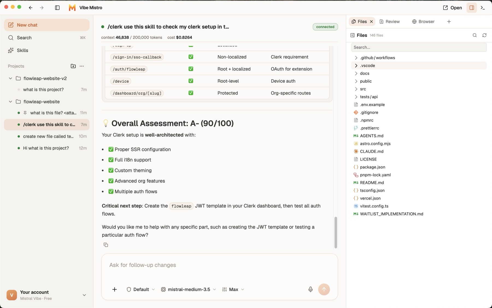

# Vibe Mistro

**[vibemistro.com](https://www.vibemistro.com)** · **[Download for macOS (Apple Silicon)](https://github.com/abdullahatrash/vibe-mistro/releases/latest/download/Vibe-Mistro-arm64.dmg)** · [Releases](https://github.com/abdullahatrash/vibe-mistro/releases)

Vibe Mistro is a desktop app for running and orchestrating [Mistral Vibe](https://docs.mistral.ai/vibe/code/cli/install-setup) coding agents across your local projects. It drives Vibe's Agent Client Protocol (ACP) server, `vibe-acp`, and gives you a full GUI on top of it: parallel workspaces, persistent conversation threads, streamed tool calls and diffs, approval controls, and a set of side surfaces (git, terminal, files, skills) so you rarely have to leave the app.



## Features

- **Workspaces & threads** — open any local project, run one warm agent per workspace, and keep many named conversation threads per project. Threads persist across restarts and resume where you left off.
- **Live conversation view** — streamed reasoning, tool calls, edit diffs, and rich markdown rendering, with search (⌘K) across thread titles and transcripts and jump-to-message.
- **Agent controls** — per-thread approval mode (default / plan / accept-edits / auto-approve / chat), model picker, and reasoning effort, all sticky per thread.
- **Permission requests** — when the agent wants to do something sensitive mid-turn, you approve or deny it inline.
- **Composer** — `/` slash-command autocomplete, image attachments, long-paste chips, and a follow-up queue with interrupt (Stop) support.
- **Git panel** — working-tree status, diffs, staging, commits, branch management, revert, and GitHub pull-request surfacing.
- **Terminal dock** — a multi-tab shell running in your workspace (⌘J).
- **Files & skills browsers** — browse workspace files with previews, and inspect the agent skills available to Vibe (with in-app SKILL.md preview).
- **Open in IDE** — jump from the app straight into your editor.
- **Settings** — environment detection plus an update check for the Vibe CLI.

Authentication is delegated entirely to Vibe: sign-in opens Mistral's browser flow, and no credentials are ever stored by the app.

## Installation

> [!WARNING]
> Vibe Mistro requires the Mistral Vibe CLI.
> Install and authenticate it before use:
>
> - Install the [Mistral Vibe CLI](https://docs.mistral.ai/vibe/code/cli/install-setup) so that `vibe` and `vibe-acp` are on your `PATH`
> - Sign in — either from the CLI, or later from inside the app (it opens the browser sign-in flow for you)

### Download (recommended)

Grab the signed, notarized DMG for macOS on Apple Silicon:

- from the website: **[vibemistro.com](https://www.vibemistro.com)**
- or directly: **[Vibe-Mistro-arm64.dmg](https://github.com/abdullahatrash/vibe-mistro/releases/latest/download/Vibe-Mistro-arm64.dmg)** (always the latest release)

The app keeps itself up to date: it downloads new releases in the background and applies them
when you restart or quit.

### Run from source

Or run it from source with [Bun](https://bun.sh):

```bash
git clone https://github.com/abdullahatrash/vibe-mistro.git
cd vibe-mistro
bun install
bun run dev
```

## Some notes

This is a beta. Expect rough edges.

There is no public docs site yet — see the markdown files in [docs](./docs).

## Documentation

- [Docs index](./docs/README.md)
- [Architecture decisions (ADRs)](./docs/adr)
- [Domain glossary](./CONTEXT.md)
- [Conventions](./docs/conventions.md)

## Contributing

The repo is a Bun-workspaces monorepo: the desktop app lives in [`apps/desktop`](./apps/desktop)
and the marketing page in [`apps/web`](./apps/web). All commands run from the repo root:

```bash
bun install
bun run dev         # launch Electron + Vite dev server
bun run dev:web     # marketing page dev server
bun run typecheck   # type-check main + renderer + web
bun run lint        # eslint
bun run test        # vitest
bun run build       # production build (both apps)
```

Before opening a PR, make sure all four gates pass:

```bash
bun run lint && bun run typecheck && bun run build && bun run test
```

## License

[MIT](./LICENSE)
